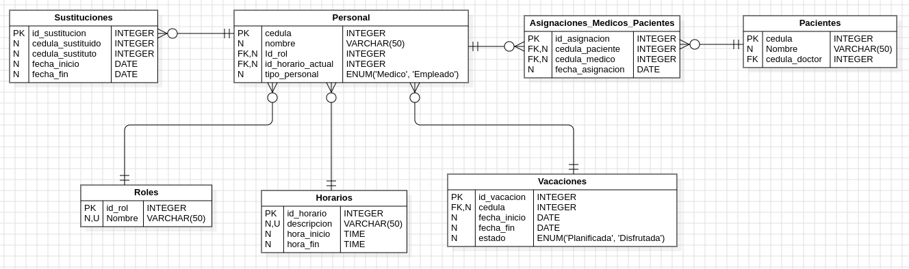

# MediSistema DB

Bienvenidos a MediSistema DB :)

## Diagrama UML resultante



### **Consultas SQL (soluciones)**:

#### 1. **Número de pacientes atendidos por cada médico:**

```sql
SELECT P.nombre AS Medico, COUNT(A.cedula_paciente) AS Numero_Pacientes
FROM Personal P
JOIN Asignaciones_Medicos_Pacientes A ON P.cedula = A.cedula_medico
WHERE P.tipo_personal = 'Medico'
GROUP BY P.nombre;
```

#### 2. **Total de días de vacaciones planificadas y disfrutadas por cada empleado:**

```sql
SELECT P.nombre, SUM(DATEDIFF(fecha_fin, fecha_inicio)) AS Dias_Vacaciones, V.estado
FROM Vacaciones V
JOIN Personal P ON V.cedula = P.cedula
GROUP BY P.nombre, V.estado;
```

#### 3. **Médicos con mayor cantidad de horas de consulta en la semana:**

```sql
SELECT P.nombre, H.descripcion, 
       (TIMESTAMPDIFF(HOUR, H.hora_inicio, H.hora_fin) * 5) AS Horas_Semanales
FROM Personal P
JOIN Horarios H ON P.id_horario_actual = H.id_horario
WHERE P.tipo_personal = 'Medico'
ORDER BY Horas_Semanales DESC;
```

#### 4. **Número de sustituciones realizadas por cada médico sustituto:**

```sql
SELECT P.nombre AS Medico_Sustituto, COUNT(S.id_sustitucion) AS Numero_Sustituciones
FROM Sustituciones S
JOIN Personal P ON S.cedula_sustituto = P.cedula
GROUP BY P.nombre;
```

#### 5. **Número de médicos que están actualmente en sustitución:**

```sql
SELECT COUNT(DISTINCT S.cedula_sustituto) AS Medicos_En_Sustitucion
FROM Sustituciones S
WHERE CURDATE() BETWEEN S.fecha_inicio AND S.fecha_fin;
```

#### 6. **Horas totales de consulta por médico por día de la semana:**

```sql
SELECT P.nombre AS Medico, H.descripcion, 
       TIMESTAMPDIFF(HOUR, H.hora_inicio, H.hora_fin) AS Horas_Por_Dia
FROM Personal P
JOIN Horarios H ON P.id_horario_actual = H.id_horario
WHERE P.tipo_personal = 'Medico';
```

#### 7. **Médico con mayor cantidad de pacientes asignados:**

```sql
SELECT P.nombre AS Medico, COUNT(A.cedula_paciente) AS Pacientes_Asignados
FROM Asignaciones_Medicos_Pacientes A
JOIN Personal P ON A.cedula_medico = P.cedula
GROUP BY P.nombre
ORDER BY Pacientes_Asignados DESC
LIMIT 1;
```

#### 8. **Empleados con más de 10 días de vacaciones disfrutadas:**

```sql
SELECT P.nombre, SUM(DATEDIFF(V.fecha_fin, V.fecha_inicio)) AS Dias_Disfrutados
FROM Vacaciones V
JOIN Personal P ON V.cedula = P.cedula
WHERE V.estado = 'Disfrutada'
GROUP BY P.nombre
HAVING Dias_Disfrutados > 10;
```

#### 9. **Médicos que actualmente están realizando una sustitución:**

```sql
SELECT P.nombre AS Medico_Sustituto
FROM Sustituciones S
JOIN Personal P ON S.cedula_sustituto = P.cedula
WHERE CURDATE() BETWEEN S.fecha_inicio AND S.fecha_fin;
```

#### 10. **Promedio de horas de consulta por médico por día de la semana:**

No tengo dias en mi estructura, pero dejo esta posible solucion a la consulta:P

```sql
SELECT AVG(TIMESTAMPDIFF(HOUR, H.hora_inicio, H.hora_fin)) AS Promedio_Horas_Diarias
FROM Personal P
JOIN Horarios H ON P.id_horario_actual = H.id_horario
WHERE P.tipo_personal = 'Medico';
```

#### 11. **Empleados con mayor número de pacientes atendidos por los médicos bajo su supervisión:**

```sql
SELECT P.nombre AS Medico, COUNT(AMP.cedula_paciente) AS Total_Pacientes
FROM Asignaciones_Medicos_Pacientes AMP
JOIN Personal P ON AMP.cedula_medico = P.cedula
WHERE P.tipo_personal = 'Medico'
GROUP BY P.nombre
ORDER BY Total_Pacientes DESC;
```

#### 12. **Médicos con más de 5 pacientes y total de horas de consulta en la semana:**

```sql
SELECT P.nombre, COUNT(A.cedula_paciente) AS Numero_Pacientes, 
       (TIMESTAMPDIFF(HOUR, MIN(H.hora_inicio), MAX(H.hora_fin)) * 5) AS Horas_Semanales
FROM Asignaciones_Medicos_Pacientes A
JOIN Personal P ON A.cedula_medico = P.cedula
JOIN Horarios H ON P.id_horario_actual = H.id_horario
GROUP BY P.nombre
HAVING Numero_Pacientes > 5;
```

#### 13. **Total de días de vacaciones planificadas y disfrutadas por cada tipo de empleado:**

```sql
SELECT P.tipo_personal, SUM(DATEDIFF(V.fecha_fin, V.fecha_inicio)) AS Dias_Vacaciones, V.estado
FROM Vacaciones V
JOIN Personal P ON V.cedula = P.cedula
GROUP BY P.tipo_personal, V.estado;
```

#### 14. **Total de pacientes por cada tipo de médico:**

```sql
SELECT P.id_rol, COUNT(A.cedula_paciente) AS Total_Pacientes
FROM Asignaciones_Medicos_Pacientes A
JOIN Personal P ON A.cedula_medico = P.cedula
GROUP BY P.id_rol;
```

#### 15. **Total de horas de consulta por médico y día de la semana:**

```sql
SELECT P.nombre, TIMESTAMPDIFF(HOUR, H.hora_inicio, H.hora_fin) AS Horas_Por_Dia
FROM Personal P
JOIN Horarios H ON P.id_horario_actual = H.id_horario
WHERE P.tipo_personal = 'Medico';
```

#### 16. **Número de sustituciones por tipo de médico:**

```sql
SELECT R.nombre AS Tipo_Medico, COUNT(S.id_sustitucion) AS Numero_Sustituciones
FROM Sustituciones S
JOIN Personal P ON S.cedula_sustituto = P.cedula
JOIN Roles R ON P.id_rol = R.id_rol
GROUP BY R.nombre;
```

#### 17. **Total de pacientes por médico y por provincia:**

Mi modelo no contempla provincias -.-

#### 18. **Empleados y médicos con más de 20 días de vacaciones planificadas:**

```sql
SELECT P.nombre, SUM(DATEDIFF(V.fecha_fin, V.fecha_inicio)) AS Dias_Planificadas
FROM Vacaciones V
JOIN Personal P ON V.cedula = P.cedula
WHERE V.estado = 'Planificada'
GROUP BY P.nombre
HAVING Dias_Planificadas > 20;
```

#### 19. **Médicos con el mayor número de pacientes actualmente en sustitución:**

```sql
SELECT P.nombre AS Medico_Sustituido, COUNT(A.cedula_paciente) AS Pacientes_Sustituidos
FROM Sustituciones S
JOIN Asignaciones_Medicos_Pacientes A ON S.cedula_sustituido = A.cedula_medico
JOIN Personal P ON S.cedula_sustituido = P.cedula
WHERE CURDATE() BETWEEN S.fecha_inicio AND S.fecha_fin
GROUP BY P.nombre
ORDER BY Pacientes_Sustituidos DESC;
```

#### 20. **Total de horas de consulta por provincia y día de la semana:**

Mi modelo no contempla provincias x2 -.-
